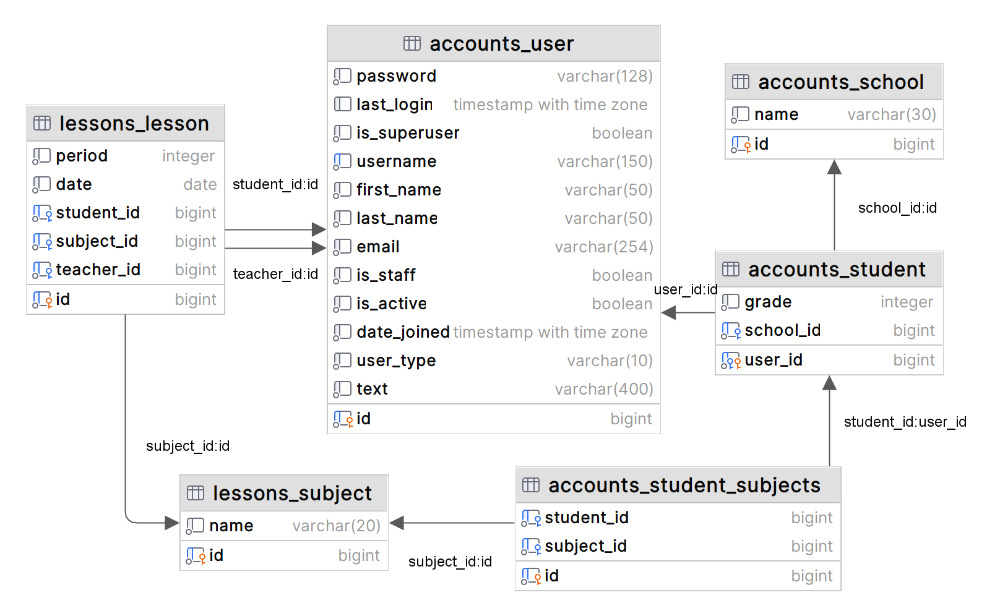

<h1 align="center">シフトくん</h1>

[//]: # (# シフトくん)

## デモサイト
[URL](https://juku-seven.vercel.app/)

## 概要
個人塾でのスケジュール管理を想定したWebアプリケーションです。

## 使用技術
- フロントエンド
  - JavaScript
  - TypeScript
  - Next.js
  - Tailwind CSS
- バックエンド
  - Python
  - Django
  - Django Rest Framework
- データベース
  - PostgreSQL
- 認証
  - JWT
- デプロイ
  - Vercel（フロントエンド）
  - Heroku（バックエンド）

## データベース設計
以下は本アプリケーションのデータベース設計のER図です。

## 機能と使い方
- ユーザー（生徒・先生）登録・ログイン機能
- 授業予定の登録
- 月ごと・日ごとで授業予定の閲覧

## 実装予定の機能
- ユーザー毎にアクセス制限をかける
- 先生（生徒）の情報を編集できるようにする
- 先生（生徒）のリストをサイドバーに移して右側で予定の確認ができるようにする
- validationをつける

## 開発の背景
アルバイト先の塾で使っているシステムが使いにくいと悩んでいたので、それを解決できるアプリケーションを目指してつくりました。

## 振り返り
- nextAuthの導入で型拡張したらimport文がうまく動かなくなってしまって作り直した
- modelsがネストしていたので登録のやり方が難しかった
- デプロイはdockerのコンテナごとやろうとしていたが、フロントとバックで分けた
